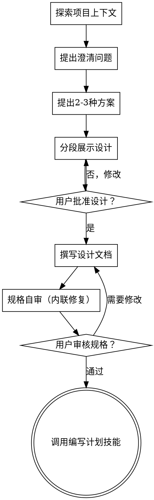

# 将想法转化为设计

通过自然的协作对话，帮助将想法转化为完整的设计和规范。

先了解当前项目上下文，然后逐个提问来完善想法。一旦理解了要构建的内容，展示设计并获取用户批准。

<HARD-GATE>
在展示设计并获得用户批准之前，不要调用任何实施技能、编写任何代码、搭建任何项目或采取任何实施行动。无论项目看起来多简单，都适用此规则。
</HARD-GATE>

## 反模式："这太简单了，不需要设计"

每个项目都要经过这个流程。一个待办列表、一个单函数工具、一个配置变更——全部如此。"简单"的项目正是未经审视的假设导致最多浪费的地方。设计可以很简短（对于真正简单的项目只需几句话），但你**必须**展示设计并获得批准。

## 检查清单

你**必须**为以下每一项创建任务，并按顺序完成：

1. **探索项目上下文** — 查看文件、文档、最近的提交
2. **提出澄清问题** — 逐个提问，了解目的/约束/成功标准
3. **提出 2-3 种方案** — 包含权衡和你的推荐
4. **展示设计** — 按各部分复杂度分段展示，每段后获取用户确认
5. **撰写设计文档** — 保存到 `docs/specs/YYYY-MM-DD-<主题>-design.md` 并提交
6. **规格自审** — 快速检查占位符、矛盾、模糊之处、范围
7. **用户审核书面规格** — 请用户在继续之前审核规格文件
8. **过渡到实施** — 调用编写计划技能创建实施计划

## 流程

**终态是调用编写计划技能。** 不要调用其他实施技能。头脑风暴之后唯一调用的技能是编写计划。

## 流程详解

**理解想法：**

- 先查看当前项目状态（文件、文档、最近提交）
- 在深入提问之前先评估范围：如果请求描述了多个独立子系统，立即标记出来
- 如果项目太大无法用单个规格覆盖，帮助用户拆解为子项目
- 对于适当范围的项目，逐个提问来完善想法
- 尽可能使用选择题，但开放式问题也可以
- 每条消息只问一个问题
- 聚焦于理解：目的、约束、成功标准

**探索方案：**

- 提出 2-3 种不同方案并附权衡分析
- 以对话方式展示选项，带上你的推荐和理由
- 先展示推荐方案并解释原因

**展示设计：**

- 一旦你认为理解了要构建的内容，展示设计
- 根据各部分复杂度调整篇幅
- 每个部分展示后询问是否看起来合理
- 覆盖：架构、组件、数据流、错误处理、测试
- 随时准备返回澄清不清楚的地方

**设计隔离和清晰：**

- 将系统拆分为更小的单元，每个单元有一个明确目的
- 通过定义良好的接口通信，可以独立理解和测试
- 更小、边界清晰的单元也更容易处理

**在现有代码库中工作：**

- 在提出变更之前先探索现有结构。遵循现有模式。
- 如果现有代码有影响工作的问题，在设计中包含有针对性的改进
- 不要提出无关的重构。保持聚焦。

## 设计完成后

**文档：**

- 将验证过的设计（规格）写入 `docs/specs/YYYY-MM-DD-<主题>-design.md`
  - （用户对规格位置的偏好优先于此默认值）
- 将设计文档提交到 git

**规格自审：**
写完规格文档后，用新鲜的眼光审视：

1. **占位符扫描：** 有"待定"、"TODO"、不完整的部分或模糊的需求吗？修复它们。
2. **内部一致性：** 各部分之间是否矛盾？架构是否与功能描述匹配？
3. **范围检查：** 是否足够聚焦用于单个实施计划？
4. **模糊检查：** 是否有需求可以被两种方式解读？如果有，选择一种并明确说明。

发现问题就内联修复。不需要重新审查——修复后继续。

**用户审核关卡：**
> "规格已写入并提交到 `<路径>`。请审核后告知我是否需要修改，然后我们再开始编写实施计划。"

等待用户回复。如果他们要求修改，修改后重新运行规格自审。只有在用户批准后才继续。

**实施：**

- 调用编写计划技能来创建详细实施计划
- 不要调用任何其他技能。编写计划是下一步。

## 核心原则

- **逐个提问** - 不要同时抛出多个问题
- **优先选择题** - 比开放式问题更容易回答
- **严格 YAGNI** - 从所有设计中移除不必要的功能
- **探索替代方案** - 始终在确定前提出 2-3 种方案
- **增量验证** - 展示设计，获得批准后再继续
- **保持灵活** - 当某些内容不合理时回头澄清
