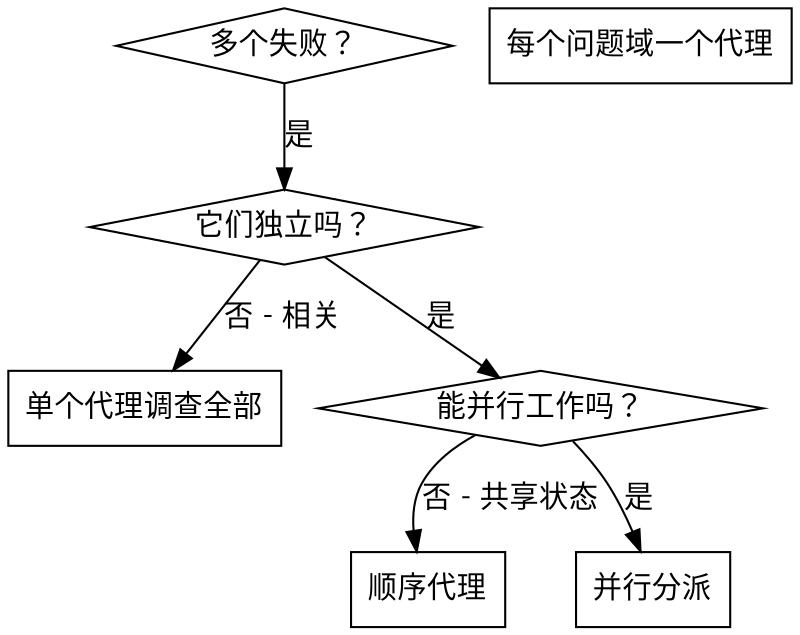

# 并行代理调度

## 概述

你将任务委派给具有隔离上下文的专门代理。通过精确构建它们的指令和上下文，确保它们保持聚焦并成功完成任务。它们不应该继承你的会话上下文或历史 — 你构建它们确切需要的内容。

当你有多个不相关的失败（不同测试文件、不同子系统、不同 bug）时，逐个调查浪费时间。每个调查是独立的，可以并行进行。

**核心原则：** 每个独立问题域分派一个代理。让它们并发工作。

## 何时使用

**使用场景：**
- 3+ 个测试文件因不同根因失败
- 多个子系统独立损坏
- 每个问题可以不需要其他问题的上下文来理解
- 调查之间无共享状态

**不使用场景：**
- 失败相关（修复一个可能修复其他）
- 需要理解完整系统状态
- 代理之间会互相干扰

## 模式

### 1. 识别独立域

按损坏内容分组失败。

### 2. 创建聚焦的代理任务

每个代理获得：
- **具体范围：** 一个测试文件或子系统
- **明确目标：** 让这些测试通过
- **约束：** 不改其他代码
- **期望输出：** 发现和修复的总结

### 3. 并行分派

### 4. 审查和集成

代理返回时：
- 阅读每个总结
- 验证修复不冲突
- 运行完整测试套件
- 集成所有变更

## 代理提示结构

好的代理提示是：
1. **聚焦的** — 一个明确的问题域
2. **自包含的** — 理解问题所需的全部上下文
3. **明确输出** — 代理应该返回什么？

## 不使用场景

**相关失败：** 修复一个可能修复其他 — 先一起调查
**需要完整上下文：** 理解需要看到整个系统
**探索性调试：** 你还不知道什么坏了
**共享状态：** 代理会互相干扰（编辑同一文件、使用相同资源）

## 验证

代理返回后：
1. **审查每个总结** — 理解变更了什么
2. **检查冲突** — 代理是否编辑了相同代码？
3. **运行完整套件** — 验证所有修复协同工作
4. **抽查** — 代理可能犯系统性错误
