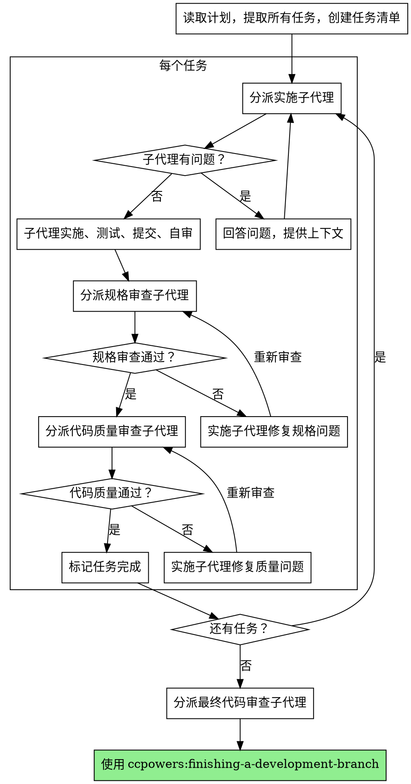

# 子代理驱动开发

通过为每个任务分派新子代理来执行计划，每个任务后进行两阶段审查：先规格合规审查，再代码质量审查。

**为什么用子代理：** 你将任务委派给具有隔离上下文的专门代理。通过精确构建它们的指令和上下文，确保它们保持聚焦并成功完成任务。这也为你保留了协调工作的上下文。

**核心原则：** 每任务新子代理 + 两阶段审查（规格 + 质量）= 高质量、快速迭代

**持续执行：** 不要在任务之间暂停与用户确认。执行计划中的所有任务不停顿。唯一停止的原因：无法解决的阻塞状态、真正阻碍进展的歧义、或所有任务完成。

## 流程

## 模型选择

使用能胜任的最低级别模型以节省成本和提高速度。

**机械实施任务**（独立函数、清晰规格、1-2 个文件）：使用快速便宜的模型。
**集成和判断任务**（多文件协调、模式匹配、调试）：使用标准模型。
**架构、设计和审查任务**：使用最强可用模型。

## 处理实施者状态

实施子代理报告四种状态之一：

**完成（DONE）：** 进入规格合规审查。

**完成但有顾虑（DONE_WITH_CONCERNS）：** 实施者完成工作但标记了疑虑。在继续前阅读顾虑。

**需要上下文（NEEDS_CONTEXT）：** 实施者需要未提供的信息。提供缺失上下文并重新分派。

**阻塞（BLOCKED）：** 实施者无法完成任务。评估阻碍因素：
1. 如果是上下文问题，提供更多上下文并用相同模型重新分派
2. 如果任务需要更多推理，用更强模型重新分派
3. 如果任务太大，拆分为更小的部分
4. 如果计划本身有误，升级给用户

## 提示模板

- `./implementer-prompt.md` — 分派实施子代理
- `./spec-reviewer-prompt.md` — 分派规格合规审查子代理
- `./code-quality-reviewer-prompt.md` — 分派代码质量审查子代理

## 危险信号

**绝不要：**
- 未经用户明确同意在 main/master 分支上开始实施
- 跳过审查（规格合规或代码质量）
- 带着未修复的问题继续
- 并行分派多个实施子代理（会冲突）
- 让子代理读取计划文件（提供完整文本代替）
- 跳过场景设定上下文
- 忽视子代理的问题
- **在规格合规通过前开始代码质量审查**（顺序错误）
- 在任一审查有未解决问题时进入下一个任务

## 集成

**需要的工作流技能：**
- **ccpowers:using-git-worktrees** — 确保隔离工作区
- **ccpowers:writing-plans** — 创建此技能执行的计划
- **ccpowers:requesting-code-review** — 审查者子代理的代码审查模板
- **ccpowers:finishing-a-development-branch** — 所有任务后完成开发
