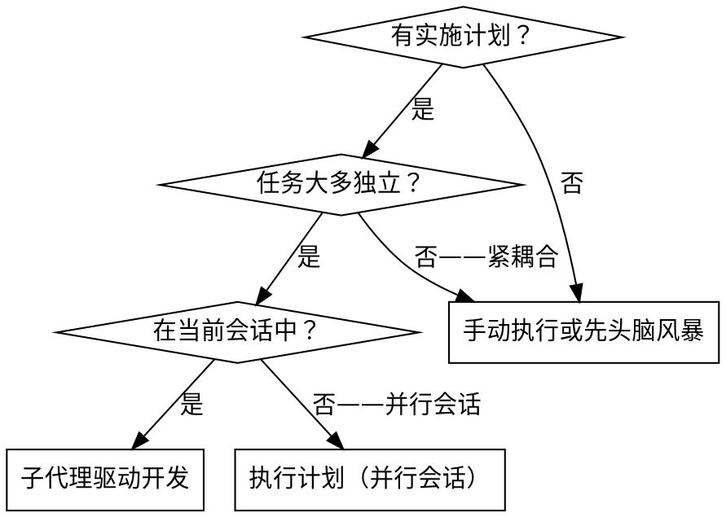
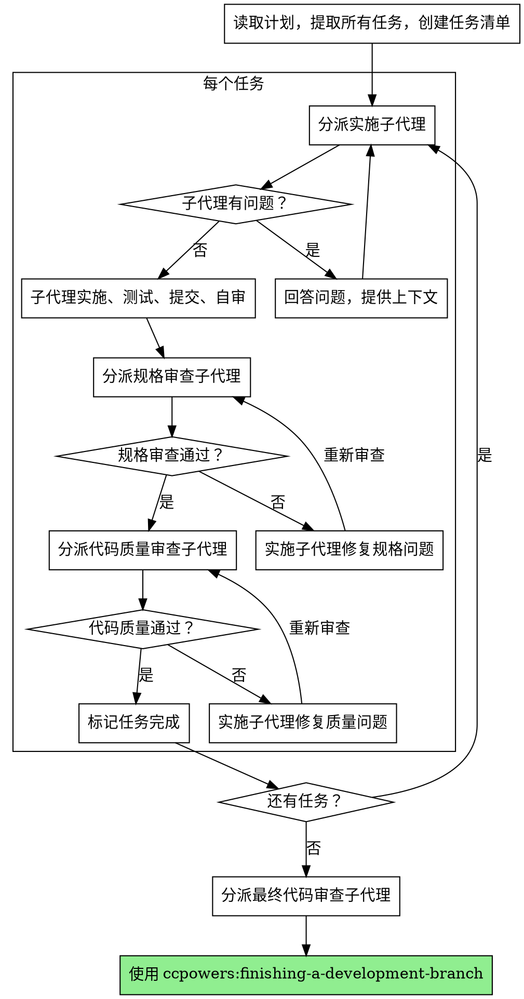

# 子代理驱动开发

通过为每个任务分派新子代理来执行计划，每个任务后进行两阶段审查：先规格合规审查，再代码质量审查。

**为什么用子代理：** 你将任务委派给具有隔离上下文的专门代理。通过精确构建它们的指令和上下文，确保它们保持聚焦并成功完成任务。这也为你保留了协调工作的上下文。

**核心原则：** 每任务新子代理 + 两阶段审查（规格 + 质量）= 高质量、快速迭代

**持续执行：** 不要在任务之间暂停与用户确认。执行计划中的所有任务不停顿。唯一停止的原因：无法解决的阻塞状态、真正阻碍进展的歧义、或所有任务完成。

## 何时使用



**vs. 执行计划（并行会话）：**
- 同一会话（无上下文切换）
- 每任务新子代理（无上下文污染）
- 每任务后两阶段审查：先规格合规，再代码质量
- 更快迭代（任务间无人工介入）

## 流程



## 模型选择

使用能胜任的最低级别模型以节省成本和提高速度。

**机械实施任务**（独立函数、清晰规格、1-2 个文件）：使用快速便宜的模型。大多数实施任务在计划良好时都是机械性的。
**集成和判断任务**（多文件协调、模式匹配、调试）：使用标准模型。
**架构、设计和审查任务**：使用最强可用模型。

**任务复杂度信号：**
- 涉及 1-2 个文件且规格完整 → 便宜模型
- 涉及多文件且有集成问题 → 标准模型
- 需要设计判断或广泛代码库理解 → 最强模型

## 处理实施者状态

实施子代理报告四种状态之一：

**完成（DONE）：** 进入规格合规审查。

**完成但有顾虑（DONE_WITH_CONCERNS）：** 实施者完成工作但标记了疑虑。在继续前阅读顾虑。

**需要上下文（NEEDS_CONTEXT）：** 实施者需要未提供的信息。提供缺失上下文并重新分派。

**阻塞（BLOCKED）：** 实施者无法完成任务。评估阻碍因素：
1. 如果是上下文问题，提供更多上下文并用相同模型重新分派
2. 如果任务需要更多推理，用更强模型重新分派
3. 如果任务太大，拆分为更小的部分
4. 如果计划本身有误，升级给用户

**永远不要**忽略升级或强迫相同模型在没有变化的情况下重试。如果实施者说它卡住了，就需要改变某些东西。

## 提示模板

- `./implementer-prompt.md` — 分派实施子代理
- `./spec-reviewer-prompt.md` — 分派规格合规审查子代理
- `./code-quality-reviewer-prompt.md` — 分派代码质量审查子代理

## 工作流示例

```
你：我使用子代理驱动开发来执行这个计划。

[读取计划文件一次：docs/plans/feature-plan.md]
[提取全部 5 个任务的完整文本和上下文]
[创建任务清单]

任务 1：Hook 安装脚本

[获取任务 1 文本和上下文（已提取）]
[分派实施子代理，附完整任务文本 + 上下文]

实施者："开始之前——hook 应该安装在用户级还是系统级？"

你："用户级（~/.config/hooks/）"

实施者："收到。开始实施..."
[完成后] 实施者：
  - 实施了 install-hook 命令
  - 添加了测试，5/5 通过
  - 自审：发现遗漏了 --force 标志，已添加
  - 已提交

[分派规格合规审查]
规格审查者：✅ 规格合规——所有需求已满足，无多余内容

[获取 git SHA，分派代码质量审查]
代码审查者：优点：测试覆盖好，代码干净。问题：无。通过。

[标记任务 1 完成]

任务 2：恢复模式

[分派实施子代理，附完整任务文本 + 上下文]

实施者：[无问题，直接开始]
实施者：
  - 添加了验证/修复模式
  - 8/8 测试通过
  - 自审：一切正常
  - 已提交

[分派规格合规审查]
规格审查者：❌ 问题：
  - 缺失：进度报告（规格说"每 100 项报告一次"）
  - 多余：添加了 --json 标志（未被要求）

[实施者修复问题]
实施者：移除 --json 标志，添加进度报告

[规格审查者再次审查]
规格审查者：✅ 现在规格合规

[分派代码质量审查]
代码审查者：优点：扎实。问题（重要）：魔法数字（100）

[实施者修复]
实施者：提取 PROGRESS_INTERVAL 常量

[代码审查者再次审查]
代码审查者：✅ 通过

[标记任务 2 完成]

...

[所有任务完成后]
[分派最终代码审查]
最终审查者：所有需求已满足，可以合并

完成！
```

## 优势

**vs. 手动执行：**
- 子代理自然遵循 TDD
- 每任务新鲜上下文（不混乱）
- 并行安全（子代理不互相干扰）
- 子代理可以提问（开始前和工作中都可以）

**vs. 执行计划（并行会话）：**
- 同一会话（无交接）
- 持续进展（无等待）
- 审查检查点自动化

**效率增益：**
- 无文件读取开销（协调者提供完整文本）
- 协调者精确策划需要的上下文
- 子代理预先获得完整信息
- 问题在工作开始前浮现（而非之后）

**质量把关：**
- 自审在交接前捕获问题
- 两阶段审查：规格合规 + 代码质量
- 审查循环确保修复确实有效
- 规格合规防止过度/不足构建
- 代码质量确保实施构建良好

**成本：**
- 更多子代理调用（每任务实施者 + 2 审查者）
- 协调者做更多准备（预先提取所有任务）
- 审查循环增加迭代
- 但早期捕获问题（比后期调试便宜）

## 危险信号

**绝不要：**
- 未经用户明确同意在 main/master 分支上开始实施
- 跳过审查（规格合规或代码质量）
- 带着未修复的问题继续
- 并行分派多个实施子代理（会冲突）
- 让子代理读取计划文件（提供完整文本代替）
- 跳过场景设定上下文
- 忽视子代理的问题
- **在规格合规通过前开始代码质量审查**（顺序错误）
- 接受"差不多"的规格合规（审查者发现问题 = 未完成）
- 跳过审查循环（审查者发现问题 = 实施者修复 = 再次审查）
- 让实施者自审替代正式审查（两者都需要）
- 在任一审查有未解决问题时进入下一个任务

**如果子代理提问：**
- 清晰完整地回答
- 如需要提供额外上下文
- 不要催促他们直接开始实施

**如果审查者发现问题：**
- 实施者（同一子代理）修复问题
- 审查者再次审查
- 重复直到通过
- 不要跳过再审

**如果子代理失败任务：**
- 分派修复子代理并附具体指令
- 不要尝试手动修复（上下文污染）

## 集成

**需要的工作流技能：**
- **ccpowers:using-git-worktrees** — 确保隔离工作区
- **ccpowers:writing-plans** — 创建此技能执行的计划
- **ccpowers:requesting-code-review** — 审查者子代理的代码审查模板
- **ccpowers:finishing-a-development-branch** — 所有任务后完成开发

**子代理应使用：**
- **ccpowers:test-driven-development** — 子代理对每个任务遵循 TDD

**替代工作流：**
- **ccpowers:executing-plans** — 用于并行会话而非同一会话执行
