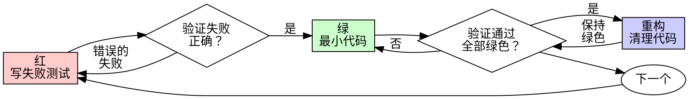

# 测试驱动开发（TDD）

## 概述

先写测试。看它失败。写最小代码使其通过。

**核心原则：** 如果你没看到测试失败，你不知道它是否测试了正确的东西。

**违反规则的字面意思就是违反规则的精神。**

## 何时使用

**始终使用：**
- 新功能
- Bug 修复
- 重构
- 行为变更

**例外（需问用户）：**
- 一次性原型
- 生成的代码
- 配置文件

想"这次就跳过 TDD 吧"？停下。那是自我合理化。

## 铁律

```
没有先失败的测试就没有生产代码
```

先写了代码再写测试？删除它。从头开始。

**没有例外：**
- 不要保留作为"参考"
- 不要在写测试时"改编"它
- 不要看它
- 删除就是删除

从测试开始全新实现。没有商量。

## 红-绿-重构



### 红 — 写失败测试

写一个最小测试展示应该发生什么。

**要求：**
- 一个行为
- 清晰的命名
- 真实代码（除非不得已不用 mock）

### 验证红 — 看它失败

**强制执行。绝不跳过。**

确认：
- 测试失败（不是报错）
- 失败信息是预期的
- 因为功能缺失而失败（不是拼写错误）

**测试通过了？** 你在测试现有行为。修改测试。

### 绿 — 最小代码

写最简单的代码使测试通过。不要添加功能、重构其他代码或"改进"超出测试范围。

### 验证绿 — 看它通过

**强制执行。**

确认：
- 测试通过
- 其他测试仍然通过
- 输出干净（无错误、无警告）

**测试失败了？** 修改代码，不是测试。

### 重构 — 清理

仅在绿色之后：
- 移除重复
- 改善命名
- 提取辅助函数

保持测试绿色。不添加行为。

### 重复

下一个失败测试对应下一个功能。

## 常见的自我合理化

| 借口 | 现实 |
|------|------|
| "太简单不需要测试" | 简单代码也会出错。测试只需 30 秒。 |
| "我之后再测试" | 立即通过的测试什么都证明不了。 |
| "事后测试达到相同目标" | 事后测试 = "它做了什么？" 先测试 = "它应该做什么？" |
| "已经手动测试过了" | 临时的 ≠ 系统的。无记录，无法重运行。 |
| "删掉 X 小时的工作太浪费了" | 沉没成本谬误。保留未验证的代码才是技术债务。 |
| "保留作参考，先写测试" | 你会改编它。那就是事后测试。删除就是删除。 |
| "需要先探索" | 可以。扔掉探索结果，从 TDD 开始。 |
| "TDD 太教条了" | TDD 就是务实的。测试先行比生产环境调试更快。 |

## 危险信号 — 停下并重新开始

- 先写了代码再写测试
- 实现后才写测试
- 测试立即通过
- 无法解释为什么测试失败
- 测试被"推迟"添加
- 自我合理化"就这一次"
- "我已经手动测试过了"

**以上所有都意味着：删除代码。从 TDD 重新开始。**

## 验证清单

标记工作完成前：

- [ ] 每个新函数/方法都有测试
- [ ] 看到了每个测试在实现前失败
- [ ] 每个测试因预期原因失败
- [ ] 写了最小代码使每个测试通过
- [ ] 所有测试通过
- [ ] 输出干净
- [ ] 测试使用真实代码（mock 仅在不得已时）
- [ ] 边界情况和错误已覆盖

无法勾选全部？你跳过了 TDD。重新开始。
