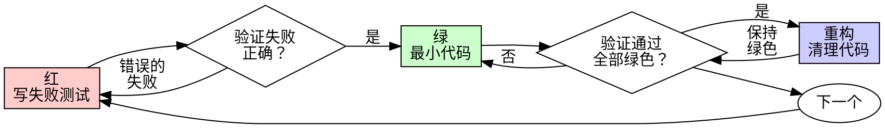

# 测试驱动开发（TDD）

## 概述

先写测试。看它失败。写最小代码使其通过。

**核心原则：** 如果你没看到测试失败，你不知道它是否测试了正确的东西。

**违反规则的字面意思就是违反规则的精神。**

## 何时使用

**始终使用：**
- 新功能
- Bug 修复
- 重构
- 行为变更

**例外（需问用户）：**
- 一次性原型
- 生成的代码
- 配置文件

想"这次就跳过 TDD 吧"？停下。那是自我合理化。

## 铁律

```
没有先失败的测试就没有生产代码
```

先写了代码再写测试？删除它。从头开始。

**没有例外：**
- 不要保留作为"参考"
- 不要在写测试时"改编"它
- 不要看它
- 删除就是删除

从测试开始全新实现。没有商量。

## 红-绿-重构



### 红 — 写失败测试

写一个最小测试展示应该发生什么。

<Good>
```typescript
test('失败操作重试 3 次', async () => {
  let attempts = 0;
  const operation = () => {
    attempts++;
    if (attempts < 3) throw new Error('fail');
    return 'success';
  };

  const result = await retryOperation(operation);

  expect(result).toBe('success');
  expect(attempts).toBe(3);
});
```
清晰命名，测试真实行为，只测一件事
</Good>

<Bad>
```typescript
test('retry works', async () => {
  const mock = jest.fn()
    .mockRejectedValueOnce(new Error())
    .mockRejectedValueOnce(new Error())
    .mockResolvedValueOnce('success');
  await retryOperation(mock);
  expect(mock).toHaveBeenCalledTimes(3);
});
```
模糊命名，测试的是 mock 而非代码
</Bad>

**要求：**
- 一个行为
- 清晰的命名
- 真实代码（除非不得已不用 mock）

### 验证红 — 看它失败

**强制执行。绝不跳过。**

确认：
- 测试失败（不是报错）
- 失败信息是预期的
- 因为功能缺失而失败（不是拼写错误）

**测试通过了？** 你在测试现有行为。修改测试。

### 绿 — 最小代码

写最简单的代码使测试通过。

<Good>
```typescript
async function retryOperation<T>(fn: () => Promise<T>): Promise<T> {
  for (let i = 0; i < 3; i++) {
    try {
      return await fn();
    } catch (e) {
      if (i === 2) throw e;
    }
  }
  throw new Error('unreachable');
}
```
刚好通过测试
</Good>

<Bad>
```typescript
async function retryOperation<T>(
  fn: () => Promise<T>,
  options?: {
    maxRetries?: number;
    backoff?: 'linear' | 'exponential';
    onRetry?: (attempt: number) => void;
  }
): Promise<T> {
  // YAGNI — 过度工程
}
```
过度工程
</Bad>

不要添加功能、重构其他代码或"改进"超出测试范围。

### 验证绿 — 看它通过

**强制执行。**

确认：
- 测试通过
- 其他测试仍然通过
- 输出干净（无错误、无警告）

**测试失败了？** 修改代码，不是测试。

### 重构 — 清理

仅在绿色之后：
- 移除重复
- 改善命名
- 提取辅助函数

保持测试绿色。不添加行为。

### 重复

下一个失败测试对应下一个功能。

## 常见的自我合理化

| 借口 | 现实 |
|------|------|
| "太简单不需要测试" | 简单代码也会出错。测试只需 30 秒。 |
| "我之后再测试" | 立即通过的测试什么都证明不了。 |
| "事后测试达到相同目标" | 事后测试 = "它做了什么？" 先测试 = "它应该做什么？" |
| "已经手动测试过了" | 临时的 ≠ 系统的。无记录，无法重运行。 |
| "删掉 X 小时的工作太浪费了" | 沉没成本谬误。保留未验证的代码才是技术债务。 |
| "保留作参考，先写测试" | 你会改编它。那就是事后测试。删除就是删除。 |
| "需要先探索" | 可以。扔掉探索结果，从 TDD 开始。 |
| "TDD 太教条了" | TDD 就是务实的。测试先行比生产环境调试更快。 |

## 为什么顺序重要

**"我之后写测试来验证它能工作"**

实现后写的测试会立即通过。立即通过什么都证明不了：
- 可能测错了东西
- 可能测的是实现而非行为
- 可能漏掉了你忘记的边界情况
- 你从未看到它捕获 bug

先测试迫使你看到测试失败，证明它确实在测东西。

**"我已经手动测试了所有边界情况"**

手动测试是临时的。你以为测全了，但：
- 没有记录测了什么
- 代码变更时无法重跑
- 压力下容易遗漏
- "我试过可以" ≠ 全面测试

自动测试是系统的。每次以相同方式运行。

**"删掉 X 小时的工作太浪费了"**

沉没成本谬误。时间已经过去了。现在的选择：
- 删除并用 TDD 重写（再花 X 小时，高信心）
- 保留并事后加测试（30 分钟，低信心，可能有 bug）

"浪费"是保留你无法信任的代码。没有真正测试的可运行代码是技术债务。

**"TDD 太教条，务实意味着灵活"**

TDD 本身就是务实的：
- 提交前发现 bug（比之后调试更快）
- 防止回归（测试立即捕获破坏）
- 记录行为（测试展示如何使用代码）
- 支持重构（自由改动，测试捕获破坏）

"务实"的捷径 = 生产环境调试 = 更慢。

**"事后测试达到相同目标——重点是精神而非仪式"**

不。事后测试回答"这做了什么？"先测试回答"这应该做什么？"

事后测试被你的实现偏见影响。你测的是你构建的东西，而非需求。先测试迫使在实现前发现边界情况。

## 危险信号 — 停下并重新开始

- 先写了代码再写测试
- 实现后才写测试
- 测试立即通过
- 无法解释为什么测试失败
- 测试被"推迟"添加
- 自我合理化"就这一次"
- "我已经手动测试过了"
- "事后测试达到相同目的"
- "重点是精神而非仪式"
- "保留作参考"或"改编现有代码"
- "已经花了 X 小时，删除太浪费"
- "TDD 太教条，我是在务实"
- "这次不一样因为..."

**以上所有都意味着：删除代码。从 TDD 重新开始。**

## 验证清单

标记工作完成前：

- [ ] 每个新函数/方法都有测试
- [ ] 看到了每个测试在实现前失败
- [ ] 每个测试因预期原因失败
- [ ] 写了最小代码使每个测试通过
- [ ] 所有测试通过
- [ ] 输出干净
- [ ] 测试使用真实代码（mock 仅在不得已时）
- [ ] 边界情况和错误已覆盖

无法勾选全部？你跳过了 TDD。重新开始。

## 示例：Bug 修复

**Bug：** 空邮箱被接受

**红**
```typescript
test('拒绝空邮箱', async () => {
  const result = await submitForm({ email: '' });
  expect(result.error).toBe('邮箱必填');
});
```

**验证红**
```bash
$ npm test
FAIL: expected '邮箱必填', got undefined
```

**绿**
```typescript
function submitForm(data: FormData) {
  if (!data.email?.trim()) {
    return { error: '邮箱必填' };
  }
  // ...
}
```

**验证绿**
```bash
$ npm test
PASS
```

**重构**
如需要，为多个字段提取通用校验。

## 卡住时

| 问题 | 解决方案 |
|------|----------|
| 不知道怎么测 | 写想象中的 API。先写断言。问用户。 |
| 测试太复杂 | 设计太复杂。简化接口。 |
| 必须 mock 一切 | 代码耦合太紧。用依赖注入。 |
| 测试 setup 太大 | 提取辅助函数。还复杂？简化设计。 |

## 调试集成

发现 bug？写一个复现它的失败测试。遵循 TDD 循环。测试证明修复有效并防止回归。

永远不要在没有测试的情况下修 bug。

## 测试反模式

添加 mock 或测试工具时，避免常见陷阱：
- 测试 mock 行为而非真实行为
- 给生产类添加仅测试用的方法
- 不理解依赖就 mock

## 最终规则

```
生产代码 → 测试存在且先失败过
否则 → 不是 TDD
```

未经用户许可，无例外。
