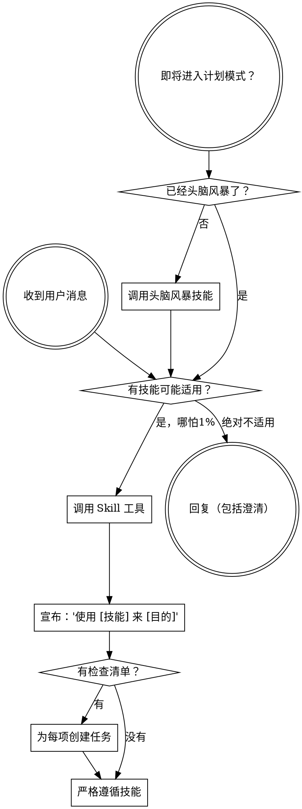

<SUBAGENT-STOP>
如果你是被作为子代理派遣来执行特定任务的，跳过此技能。
</SUBAGENT-STOP>

<EXTREMELY-IMPORTANT>
如果你认为哪怕只有 1% 的可能性某个技能适用于当前任务，你**必须**调用该技能。

如果某个技能适用于你的任务，你没有选择。你必须使用它。

这不可协商。这不是可选的。你不能为自己的逃避找借口。
</EXTREMELY-IMPORTANT>

## 指令优先级

ccpowers 技能覆盖默认系统提示行为，但**用户指令始终具有最高优先级**：

1. **用户的显式指令**（CLAUDE.md、直接请求）— 最高优先级
2. **ccpowers 技能** — 在冲突处覆盖默认系统行为
3. **默认系统提示** — 最低优先级

如果 CLAUDE.md 说"不使用 TDD"而技能说"始终使用 TDD"，遵循用户的指令。用户拥有控制权。

## 如何使用技能

**在 Claude Code 中：** 使用 `Skill` 工具。当你调用一个技能时，其内容会被加载并呈现给你——直接遵循它。永远不要使用 Read 工具读取技能文件。

# 使用技能

## 核心规则

**在任何回复或行动之前，先调用相关或被请求的技能。** 哪怕只有 1% 的可能性某个技能适用，也应该调用它来检查。如果调用后发现技能不适用于当前情况，你不需要使用它。

## 危险信号

这些想法意味着停下——你在自我合理化：

| 想法 | 现实 |
|------|------|
| "这只是一个简单问题" | 问题也是任务。检查技能。 |
| "我需要先了解更多上下文" | 技能检查在澄清问题之前。 |
| "让我先探索代码库" | 技能告诉你如何探索。先检查。 |
| "我可以快速检查 git/文件" | 文件缺少对话上下文。先检查技能。 |
| "让我先收集信息" | 技能告诉你如何收集信息。 |
| "这不需要正式的技能" | 如果技能存在，就使用它。 |
| "我记得这个技能" | 技能会更新。读取当前版本。 |
| "这不算是一个任务" | 行动 = 任务。检查技能。 |
| "用技能太小题大做了" | 简单的事情会变复杂。使用它。 |
| "我先做完这一件事" | 做任何事之前先检查。 |
| "这感觉很有效率" | 不受约束的行动浪费时间。技能防止这种情况。 |
| "我知道那是什么意思" | 知道概念 ≠ 使用技能。调用它。 |

## 技能优先级

当多个技能可能适用时，使用以下顺序：

1. **流程技能优先**（头脑风暴、调试）- 决定如何处理任务
2. **实施技能其次**（前端设计、MCP 构建器）- 指导执行

"让我们构建 X" → 先头脑风暴，再用实施技能。
"修复这个 bug" → 先调试，再用领域特定技能。

## 技能类型

**严格型**（TDD、调试）：严格遵循。不要因为变通而放弃纪律。

**灵活型**（模式）：将原则适配到具体情境。

技能本身会告诉你它属于哪种类型。

## 用户指令

指令说明做什么，不说明怎么做。"添加 X"或"修复 Y"不意味着跳过工作流。
